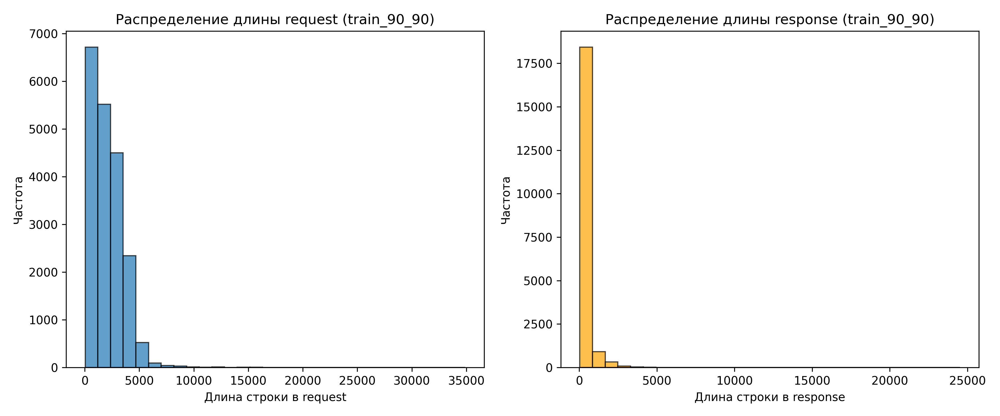
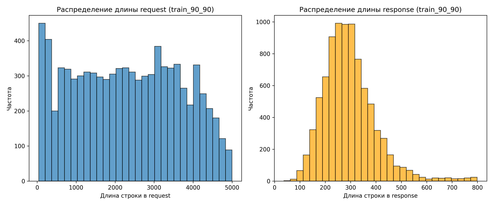

# Используемые модели и датасеты

## Модели

1. **Llama 3.2 1B Instruct RU**  
   Дообученная Llama 3.2 1B Instruct на русскоязычном датасете командой Vikhr.  

   [Ссылка на модель](https://huggingface.co/Vikhrmodels/Vikhr-Llama-3.2-1B-Instruct)

2. **Llama 3.1 8B Instruct RU**  
   Дообученная Llama 3.1 8B Instruct на русскоязычном датасете командой Vikhr.  

   [Ссылка на модель](https://huggingface.co/Vikhrmodels/Vikhr-Llama3.1-8B-Instruct-R-21-09-24)

3. **T-lite-it-1.0**  
   LLM семейства qwen2, 7.6b ~ 8b параметров, дообученная Т-банковцами для генерации текста на русском языке.  

   [Ссылка на модель](https://huggingface.co/t-tech/T-lite-it-1.0)

4. **T-pro-it-1.0**  
   LLM семейства qwen2.5, 32.8b ~ 33b параметров, дообученная Т-банковцами для генерации текста на русском языке.  

   [Ссылка на модель](https://huggingface.co/t-tech/T-pro-it-1.0)

5. **Nemo 12B Instruct RU**  
   Дообученная Nemo 12B на русскоязычном датасете командой Vikhr.  

   [Ссылка на модель](https://huggingface.co/Vikhrmodels/Vikhr-Nemo-12B-Instruct-R-21-09-24)

---

## Датасеты

1. **forum**  
   Русскоязычный датасет, полученный самостоятельным парсингом психологических форумов (~2000 строк).  
   Формат: `вопрос1 - ответ1`, `вопрос1 - ответ2`, `вопрос2 - ответ1` и т.д.  
   Обработка:
   - Удалены вопросы и ответы с низкой репутацией или короткой длиной.
   - Удалены специфичные для форумов приписки к пользователям, например:  
     `Елена ответил(а) Александру:`, `Елена ответил(а) через 5 минут:`.

2. **forum-gpt**  
   Объединение датасета `forum` с самостоятельно сгенерированными вопросами и ответами GPT-4o психологического характера (~2500–3000 строк).  

3. **STCD**  
   Датасет с Kaggle: [Synthetic Therapy Conversations Dataset](https://www.kaggle.com/datasets/thedevastator/synthetic-therapy-conversations-dataset).  
   Особенности:
   - Содержит диалоги человека с ChatGPT с фокусом на улучшение психологического состояния.  
   - Размер (~8000 строк).
   - Обработка:
     - Удалены имена.
     - Перевод из json в текстовый формат с добавлением тегов <USER> и <ASSISTANT>
     - Переведен на русский язык с использованием `googletrans` (около 8 часов работы скрипта).  

4. **STCD-big-ver1**  
   Расширенная версия STCD (>22,000 строк).  

5. **STCD-GMPM**  
   Объединение:
   - ~11,000 строк из `STCD-big-ver1`.
   - ~5000 строк из [Grand Master Pro Max](https://huggingface.co/datasets/Vikhrmodels/GrandMaster-PRO-MAX), инструктивного датасета, сгенерированного LLM. Выбирал именно те строки, у которых менее 1024 токенов в вопросах и ответах, и в которых встречаются ключевые слова "психология", "учеба", "университет", "стресс" и тд.

6. **STCD-GMPM_S**  
   Объединение:
   - ~18,000 строк из `STCD-big-ver1` на train.
      - ~2,000 из `STCD-big-ver1` строк на valid
      - ~2,000 из `STCD-big-ver1` строк на test
      - train + test + valid - в сумме дают весь датасет STCD-big-ver1 и между собой не пересекаются.
   - ~2000 строк из [Grand Master Pro Max](https://huggingface.co/datasets/Vikhrmodels/GrandMaster-PRO-MAX), инструктивного датасета, сгенерированного LLM. Выбирал именно те строки, у которых менее 1024 токенов в вопросах и ответах, и в которых встречаются ключевые слова "психология", "учеба", "университет", "стресс" и тд.

7. **STCD-GMPM_T-PSYCH**  
   Объединение:
   - ~18,000 строк из `STCD-big-ver1` на train.
      - ~2,000 из `STCD-big-ver1` строк на valid
      - ~2,000 из `STCD-big-ver1` строк на test
      - train + test + valid - в сумме дают весь датасет STCD-big-ver1 и между собой не пересекаются.
   - ~700 строк из [Grand Master Pro Max](https://huggingface.co/datasets/Vikhrmodels/GrandMaster-PRO-MAX), инструктивного датасета, сгенерированного LLM. Выбирал именно те строки, у которых менее 1024 токенов в вопросах и ответах, и в которых встречаются ключевые слова "психология", "учеба", "университет", "стресс" и тд.
   - ~2400 строк было спарсено с психологического форума, где пользователи задавали вопросы под профилями опытных и практикующих психологов, а те им отвечали. Этот датасет схож с датасетом "forum": также использовался парсинг веб-страниц и проводилась аналогичная очистка данных. Имена были удалены с помощью natasha, но в отличие от "forum", ответы здесь давали не обычные участники форума, а профессиональные психологи.

8. **STCD-PSYCH**  
   Объединение:
   - ~18,000 строк из `STCD-big-ver1` на train.
      - ~2,000 из `STCD-big-ver1` строк на valid
      - ~2,000 из `STCD-big-ver1` строк на test
      - train + test + valid - в сумме дают весь датасет STCD-big-ver1 и между собой не пересекаются.
   - ~2400 строк было спарсено с психологического форума, где пользователи задавали вопросы под профилями опытных и практикующих психологов, а те им отвечали. Этот датасет схож с датасетом "forum": также использовался парсинг веб-страниц и проводилась аналогичная очистка данных. Имена были удалены с помощью natasha, но в отличие от "forum", ответы здесь давали не обычные участники форума, а профессиональные психологи.

9. **STCD-PSYCH-COMBINED**  
   Как это было:
   - 1 этап) взял STCD-big-ver1 (>22,000 строк) поделил его следующим образом: train 81% от STCD-big-ver1, test 10% от STCD-big-ver1 и valid 9% от STCD-big-ver1. Между собойб train, test и valid не пересекаются.
   - 2 этап) точно такое же деление проделал с ответами психологов с одного психологического форума, где всего около 2400 строк.
   - 3 этап) объединил train с STCD-big-ver1 и train c ответами психологов с одного психологического форума, тоже самое проделал с test и valid. В итоге train, valid, test присутсвуют как синтетические эмпатичные ответы, так и психологическая консультация/помощь от реальных людей психологов.

   - Собственно, LLM получается на полученном train, веса корректируются на полученной valid, и итоговая проверка на test.

10. **STCD-PSYCH-COMBINED-length-filtered**

    В основе этого датасета лежит **STCD-PSYCH-COMBINED**, к которому были применены несколько фильтраций (к train, valid, test частям):

    1. **Ограничение максимальной длины**  
       - Удалены строки, в которых хотя бы один из столбцов (`request`/`response`) содержал текст длиннее **5000 символов**.  
       - Это позволило убрать слишком длинные запросы и ответы.

    2. **Равномерное распределение длин запросов**  
       - Внутри столбца `request` выделены диапазоны длин:  
         `[0-1000]`, `[1000-2000]`, `[2000-3000]`, `[3000-4000]`, `[4000-5000]`.  
       - Из каждого диапазона случайным образом выбрано **по 2000 строк**.  
       - Итоговое распределение длин `request` получилось равномерным.  
         
    3. **Ограничение длины ответов**  
       - Удалены строки, где `response` превышал **800 символов**.  
       - Это позволило добиться нормального распределения длин `response`.

    **Итоговый размер датасета**: ~9000 строк.  

    **Визуализация изменений**:  
    - **До фильтрации**:  
      
        

    - **После фильтрации**:  
      
        
   
11. **HF-jkhedri-psychology-translated**  
    Датасет с Hugging Face: [jkhedri/psychology-dataset](https://huggingface.co/datasets/jkhedri/psychology-dataset).  
    Особенности:
    - Содержит вопросы психологического характера и два типа ответов:  
      1) Эмпатичный и поддерживающий ответ.  
      2) Негативный и пессимистичный ответ.  
    - Для обучения использовались только вопросы и **первый** тип ответов.  
    - Размер (~9000 строк).  

    Обработка:
    - Переведен на русский язык с использованием GPT-4o mini через API.  
    - Удалены:
      - Имена.  
      - Ссылки.  
      - Английские и китайские символы.  
    - Датасет разделен на train (81%), valid (9%), test (10%).  

12. **HF-jkhedri-psychology-translated-filtered**  
    Отфильтрированная версия `HF-jkhedri-psychology-translated`.  

    Особенности:
    - После fine-tune на `HF-jkhedri-psychology-translated` выявлены нежелательные элементы в ответах.  
    - Модель начала рекомендовать терапию и медикаменты, что несет потенциальные риски.  
    - Размер (~7000 строк).  

    Обработка:
    - Удалены слова **"терапия"**, **"медикамент"** и их производные.  
    - Датасет разделен на train (81%), valid (9%), test (10%).  

13. **HF-mental_health_data-translated**  
    Датасет с Hugging Face: [YvvonM/mental_health_data](https://huggingface.co/datasets/YvvonM/mental_health_data).  
    Особенности:
    - Содержит три столбца:  
      - `Instruction` — промпт для LLM.  
      - `Input` — пользовательский запрос, связанный с психологическими или эмоциональными проблемами.  
      - `Response` — эмпатичный и поддерживающий ответ.  
    - Размер (~1 760 000 строк).  

    Обработка:
    - Переведен на русский язык с использованием GPT-4o mini через API (переведены первые **16 000** строк).  
    - Удалены:
      - Имена.  
      - Ссылки.  
      - Английские и китайские символы.  
      - Слова **"терапия"**, **"медикамент"** и их производные.  
    - Датасет разделен на train (81%), valid (9%), test (10%).  

14. **HF-mental_health_data-translated-filtered**  
    Отфильтрированная версия `HF-mental_health_data-translated`.  

    Особенности:
    - После fine-tune модели на `HF-mental_health_data-translated` выявлена неоднозначность в формах обращения.  
    - Модель могла использовать как "ты", так и "вы" в одном диалоге.  
    - Датасет был заново переведен, с закреплением **единого обращения на "ты"**.  
    - Размер (~16 000 строк).  

    Обработка:
    - Переведен на русский язык с использованием GPT-4o mini через API.  
    - Удалены:
      - Имена.  
      - Ссылки.  
      - Английские, китайские, арабские и тайские символы.  
      - Слова **"терапия"**, **"медикамент"** и их производные.  
    - Датасет разделен на train (81%), valid (9%), test (10%).  

15. **STCD-GPT-Translated-Half**  
   Исходник: датасет `STCD-big-ver1`.
   Особенности:
   - Содержит диалоги человека с ChatGPT с фокусом на улучшение психологического состояния.  
   - Размер (~10000 строк).
   - Обработка:
     - Перевод из json в текстовый формат с добавлением тегов <USER> и <ASSISTANT>
     - Переведен на русский язык с использованием `gpt 4o-mini`.
     - Удалены:
       - Имена.
       - Ссылки.
       - Буквы не из русского языка.
       - Слова **"терапия"**, **"медикамент"** и их производные.
     - Датасет разделен на train (81%), valid (9%), test (10%).  

---

## Структура проекта

   Проект содержит файлы и папки, связанные с обучением и тестированием моделей, а также анализом данных.  

   ### Основные директории  

   - **`test_base_models`**  
   - Тестовые ответы моделей **до обучения (fine-tuning)** на контрольных примерах.  

   - **`datasets_preview`**  
   - Первые 25 случайных строк из используемых датасетов.  
   - **Полные версии датасетов не размещены** из-за ограничений GitHub на размер файлов.  

   - **`llama-3.1-8b-finetunes`**, **`llama-3.2-1b-finetunes`**, **`t-lite-it-8b-finetunes`**, **`t-pro-it-33b-finetunes`**, **`nemo-it-12b-finetunes`**  
   - Папки с версиями моделей **после обучения (fine-tuning)**.  
   - В каждой из них находятся папки с конкретными экспериментами, например:  
      ```text
      llama-3.2-1b-ep5-STCD
      ```
      - **llama-3.2-1b** — версия и размер модели.  
      - **ep5** — количество эпох обучения.  
      - **STCD** — название датасета.  

---
